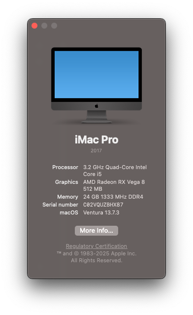

# Lenovo-ThinkCentre-M715q-2nd-Gen-Hackintosh
## Installed Ventura

Also tried Sonoma and Sequoia, it's not as stable as Ventrua

## Hardware Spec:

- CPU: AMD Ryzen 3 2200GE
- RAM: 8G + 16G DDR4
- STORAGE: WD 256G NVME

## Note:

- After installation, update config.plist with config-gfx.plist for GPU acceleration.
- Chromium based browser halts the whole system. It's a known issues from NootedRed.
- WiFi card Qualcomm QCA6174A doesn't work under MacOS. You can use Android USB tether feature to access network.
- Please update SMBIOS with https://github.com/corpnewt/GenSMBIOS
